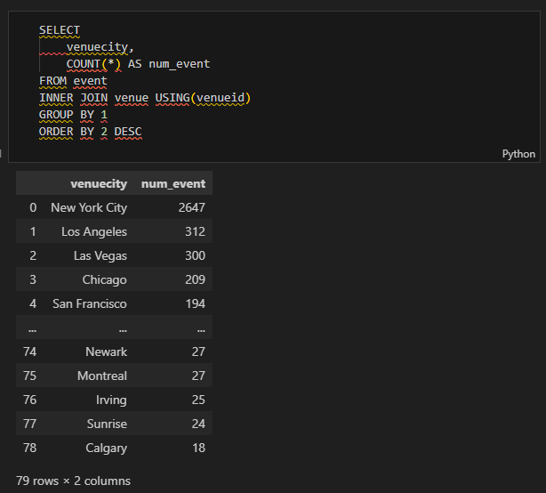
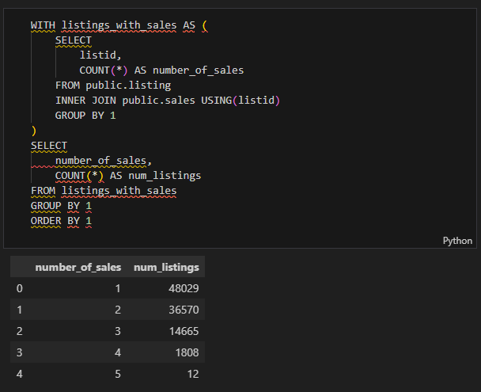
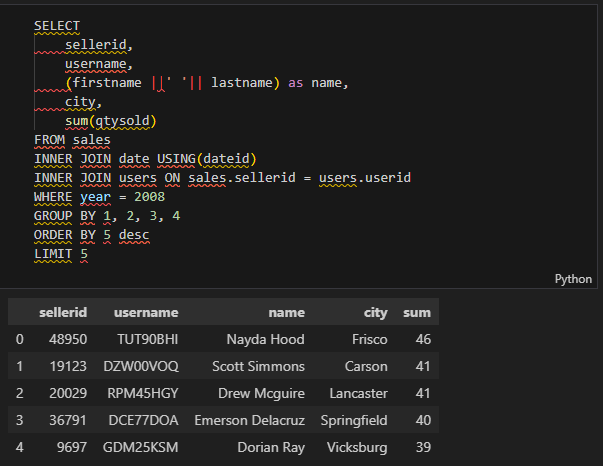
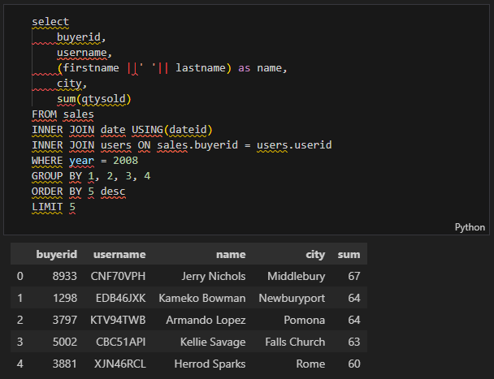
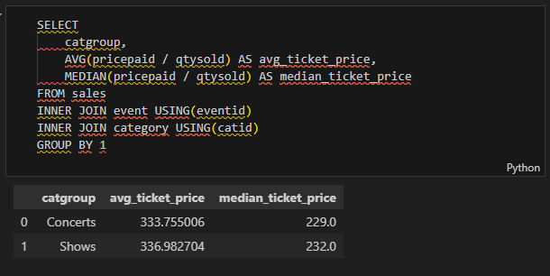
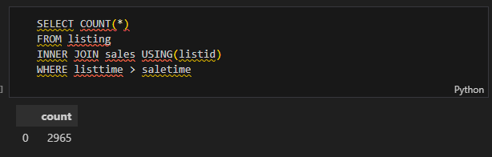
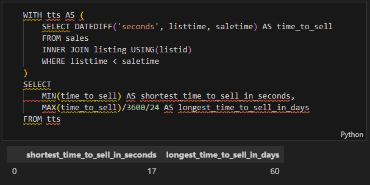
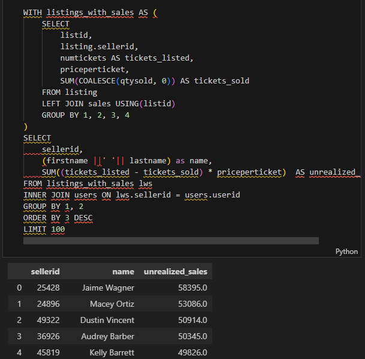
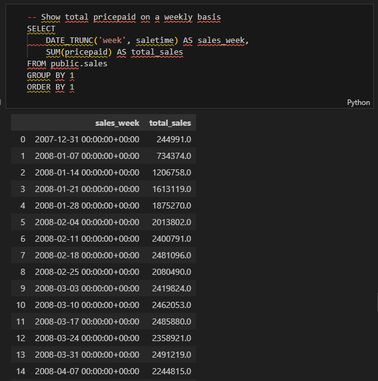

# Analyzing Online Ticket Sales with Amazon Redshift

## 📋 Project Description

This project analyzes sales activity from a fictional ticketing website where users both buy and sell tickets online for sporting events, shows, and concerts. The analysis leverages **Amazon Redshift**, a powerful data warehouse solution, to extract meaningful insights from large-scale ticket sales data. By combining data from multiple interconnected tables (events, venues, users, listings, and sales), this project demonstrates how to uncover business intelligence from complex datasets using SQL.

**Data Source:** [AWS Redshift Sample Database](https://docs.aws.amazon.com/redshift/latest/dg/c_sampledb.html)

---

## ✨ Project Highlights

### 🎯 Key Analyses Performed:
- **Event Distribution Analysis**: Identified events across multiple cities and venues
- **Sales Behavior**: Analyzed listing-to-sale conversion patterns and identified listings with multiple sales
- **User Performance Metrics**: Identified top sellers and buyers on the platform
- **Pricing Intelligence**: Compared average ticket prices across different event categories
- **Data Quality Assessment**: Detected and handled data anomalies in the listing and sales data
- **Time-to-Sell Analysis**: Calculated shortest and longest times for listings to convert to sales
- **Revenue Optimization**: Identified high-value users with unrealized sales potential for targeted advertising
- **Trend Analysis**: Visualized sales performance over time to understand seasonal patterns

---

## 🔍 Business Questions & Outcomes

### 1. **Event Distribution Across Cities**
**Question:** How many events are happening in different cities?

**Outcome:** 
- Mapped event distribution across geographical locations
- Identified top markets for ticketing platform
- Useful for understanding regional demand patterns

**SQL Query Screenshot:**


---

### 2. **Listing to Sales Conversion Analysis**
**Question:** Do multiple sales happen for the same listing?

**Outcome:**
- Discovered that the majority of listings have only one sale associated with them
- Identified 12 listings with 5 sales (anomaly requiring investigation)
- Understood resale patterns on the platform

**SQL Query Screenshot:**


---

### 3. **Top Sellers Performance (2008)**
**Question:** Who are the users that sold the most tickets in 2008?

**Outcome:**
- Identified top 5 sellers by quantity sold
- Captured seller details (name, location, username)
- Revealed high-performing sellers for potential partnership/incentive opportunities

**SQL Query Screenshot:**


---

### 4. **Top Buyers Performance (2008)**
**Question:** Who are the most active buyers on the site in 2008?

**Outcome:**
- Identified top 5 buyers by purchase quantity
- Analyzed buying patterns and geographic distribution
- Revealed high-value customers for retention strategies

**SQL Query Screenshot:**


---

### 5. **Ticket Price Analysis by Event Category**
**Question:** Is there a significant difference in average sales price across different event categories?

**Outcome:**
- Compared average and median ticket prices by event category
- Identified premium event categories vs. budget-friendly ones
- Provided pricing insights for dynamic pricing strategies

**SQL Query Screenshot:**


---

### 6. **Data Quality & Integrity Check**
**Question:** Are there listings where sales happened before the listing was created?

**Outcome:**
- Detected 2965 anomalous records where `listtime > saletime`
- Validated data integrity
- Confirmed data quality for downstream analysis

**SQL Query Screenshot:**


---

### 7. **Time-to-Sale Analysis**
**Question:** What's the shortest and longest time it takes for a listing to be sold?

**Outcome:**
- **Shortest Time:** 17 Seconds
- **Longest Time:** 60 Days
- Provided insights into market liquidity and demand velocity
- Identified seasonal or category-specific sales velocity patterns

**SQL Query Screenshot:**


---

### 8. **Unrealized Sales Opportunity Identification**
**Question:** Which users have the most outstanding listings (highest unrealized revenue)?

**Outcome:**
- Identified **Jaime Wagner** with **$58,000** in unrealized sales
- Created a targeted list of top 100 users for advertising campaigns
- Quantified revenue recovery opportunity through strategic advertising

**Business Impact:**
- Enables focused marketing budget allocation
- Potential revenue increase through improved conversion rates
- Priority user engagement program

**SQL Query Screenshot:**


---

### 9. **Sales Trends Over Time**
**Question:** How do sales volumes fluctuate over time?

**Outcome:**
- Observed weekly sales patterns
- Identified peak and low-volume periods
- Enabled better inventory and resource planning

**Visualization:**


---

## 🛠️ Technologies & Tools

| Component | Technology |
|-----------|-----------|
| **Data Warehouse** | Amazon Redshift |
| **Query Language** | SQL |
| **Notebook Environment** | Jupyter Notebook |
| **Data Processing** | Pandas |

---

## 📊 Database Schema Overview

### Key Tables:
- **`event`**: Event information (venue, category, start time)
- **`venue`**: Venue details (city, state, capacity)
- **`category`**: Event categories (sports, concerts, shows, etc.)
- **`date`**: Date dimension table
- **`listing`**: Ticket listings (price, quantity, seller info)
- **`sales`**: Completed transactions (buyers, sellers, qty, price)
- **`users`**: User profiles (sellers and buyers)

### Relationships:
- Events link to Venues, Categories, and Dates
- Listings link to Events and Sellers
- Sales link to Listings, Buyers, Sellers, and Date information

---

## 🎓 Key Insights & Learnings

1. **Data Integration**: Successfully combined data from 7+ interconnected tables to create comprehensive analytical views
2. **Query Optimization**: Used JOINs, CTEs, and aggregations to efficiently process large datasets in Redshift
3. **Data Validation**: Implemented data quality checks to identify and handle anomalies
4. **Business Translation**: Converted technical data into actionable business recommendations
5. **Visualization Impact**: Demonstrated the value of visual representations in communicating trends

---

## 📁 Project Structure

```
Analyzing-Ticket_Sales_Data_in_Amazon_Redshift/
├── notebook.ipynb         : Main analysis notebook
└── README.md              : Project documentation 
```

---

## 🚀 How to Use This Project

### Prerequisites:
- Access to Amazon Redshift cluster with sample database
- Python 3.7+
- Jupyter Notebook
- Required Python libraries: `pandas`, `plotly`, `redshift_connector` (or similar)

### Steps to Reproduce:
1. Clone this repository
2. Set up your Redshift connection credentials
3. Open `notebook.ipynb` in Jupyter Notebook
4. Run cells sequentially to execute each analysis
5. Modify queries and parameters as needed for your specific use case

---

## 💡 Potential Applications & Extensions

### Business Use Cases:
- **Revenue Optimization**: Use unrealized sales data to implement targeted advertising campaigns
- **Dynamic Pricing**: Implement category-based pricing strategies based on historical analysis
- **Inventory Management**: Plan allocation of high-demand event categories
- **User Segmentation**: Create buyer/seller personas for personalized engagement
- **Churn Prevention**: Identify inactive high-value users for retention campaigns

### Technical Extensions:
- Implement predictive models for listing-to-sale conversion rates
- Build real-time dashboards using Amazon QuickSight
- Develop recommendation engines for cross-selling opportunities
- Create automated alert systems for data anomalies
- Export insights to data visualization tools (Tableau, Power BI)

---

## 📝 License
This project uses sample data from AWS Redshift documentation. See [AWS Terms of Service](https://aws.amazon.com/terms/) for data usage restrictions.

---

## 📞 Contact & Support
For questions or suggestions about this project, please [create an issue](link-to-issues) or reach out via email.

---

## 📚 Additional Resources

- [Amazon Redshift Documentation](https://docs.aws.amazon.com/redshift/)
- [AWS Sample Database Documentation](https://docs.aws.amazon.com/redshift/latest/dg/c_sampledb.html)
- [Plotly Documentation](https://plotly.com/)
- [SQL Best Practices for Data Warehouses](https://www.postgresql.org/docs/)

---

*Last Updated: March 9, 2026*
